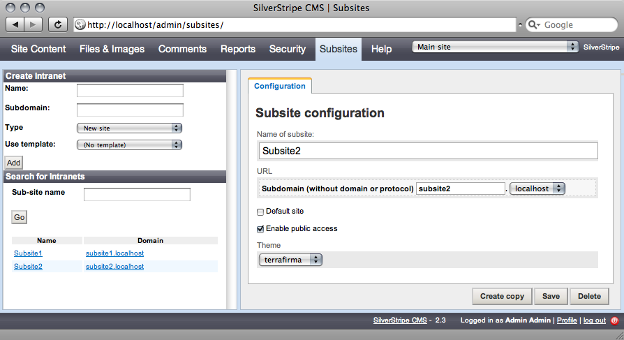
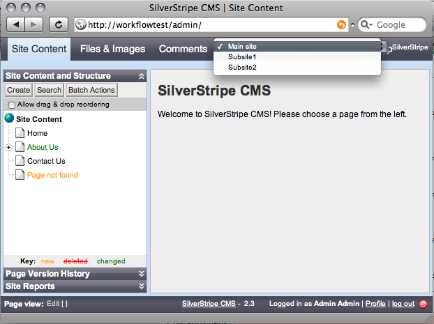

# Subsites Module

## Introduction

The subsites module allows multiple websites to run from a single installation of SilverStripe, and share users, content, and assets between them. A useful way to think of its use is where you have a business with a global headquarters and four branches in various countries. The subsites module allows the five offices to use a single SilverStripe installation, and have information from the headquarters flow down into the branches. The branches can have separate users/admins, and information that is individual. The website templates can also be different.

## Requirements

*  SilverStripe 2.3

## Download

subsites doesn't currently have a stable release.  If you would like to use it, you should download the "trunk" version.

If you have subversion, you do this by executing ''svn checkout http://svn.silverstripe.com/open/modules/subsites/trunk subsites'' within your project folder.

If you don't have subversion, you can [download a ZIP file](http://open.silverstripe.com/changeset/latest/modules/subsites/trunk?old_path=/&filename=/modules/subsites/trunk&format=zip) and copy the ''modules/subsites/trunk'' folder into your project folder, and rename it to ''subsites''.

For SilverStripe versions 2.3.x this forum entry might be useful in getting the compatible sources, since the trunk is probably using SS 2.4 API by now: [Successful installation of Subsites module on SS 2.3.0 (2.3.7 seems feasible)](http://www.silverstripe.org/all-other-modules/show/281695#post281695)

## Installation

*  Visit the URL ''db/build?flush=1'' on your site; eg, http://localhost/mysite/db/build?flush=1 or http://www.example.com/db/build?flush=1 - you should see a Subsite table created, among other things.

*  Once that has finished running, open the CMS.  You should now see Subsites on the main menu.  Click it to open the subsite administrator.

*  Create a new subsite, giving it a name and a subdomain.  The subdomain will determine the URL of your website.  For example, if your site is running on http://localhost/mysite, and you set the subdomain to "subsite", then your subsite will be accessible on http://subsite.localhost/mysite

*  Once you have created and saved your new subsite, go back to the Site Content section.  In the top-right, there should be a dropdown listing the two subsites - "Main site" is the original site that you had before you installed the subsites module.  Select your new subsite, and the site content tree will be updated.  It should be empty at this stage.

*  Add a page - change its title to "Home", and its URL Segment will be changed to "home".  Save the page.

*  Update your DNS and, if necessary, your webserver configuration, so that your subdomain will point to the SilverStripe installation on your webserver.  Visit this new subdomain.  You should see the new subsite homepage.

## Usage

### Download new themes

Download a second theme from http://www.silverstripe.com/themes/ and put it in your themes folder.  Open admin/subsites?flush=1 and select one of your subsites from the menu on the bottom-left.  You should see a Theme dropdown in the subsite details, and it should list both your original theme and the new theme.  Select the new theme in the dropdown.  Now, this subsite will use a different theme from the main site.

### Limit themes for a subsite

Not all themes might be suitable or adapted for all subsites. You can optionally limit usage of themes:

*mysite/_config.php*

	:::php
	Subsite::set_allowed_themes(array('blackcandy','mytheme'));

### Set the domains for your subsites

You can list available domains for your subsites (Example: subdomain.''domain''.tld). The subsites are generally identified only by their subdomain part (Example: ''subdomain''.domain.tld).

This example would let you create subsites such as ''wellington.mycompany.com'' or ''london.mycompany.org''

*mysite/_config.php*

	:::php
	Subsite::set_allowed_domains(array(
	   'mycompany.com',
	   'mycompany.org'
	));

If you would like to be able to choose any domain for your subsite, rather than subdomains off a common base, then list top-level domains in your ''set_allowed_domains()'' list.

In this example, your subsite name (e.g. ''silverstripe''), will be appended to a much shorter base domain (e.g.  ''co.nz'', or ''org'').  This would let you create subsites with domains such as ''silverstripe.org'' or ''example.co.nz''

*mysite/_config.php*

	:::php
	Subsite::set_allowed_domains(array(
	   'com',
	   'org',
	   'co.nz',
	   'org.nz',
	));

You can mix the two together, if you want to have some subsites hosted off subdomains of your mail site, and some subsites hosted off their own domains.  In this example, you could set up subsites at ''wellington.example.com'', ''othersite.co.nz'', or ''thirdsite.org''.

*mysite/_config.php*

	:::php
	Subsite::set_allowed_domains(array(
	   'example.com',
	   'com',
	   'org',
	   'co.nz',
	   'org.nz',
	));

Note that every site also has a ''www.''-prefixed version of the domain available.  For example, if your subsite is accessible from ''wellington.example.org'' then it will also be accessible from '''www.wellington.example.org''.

### Permissions ###

Groups can be associated with one or more subsites, in which case the granted permissions
only apply to this subsite. Even the `ADMIN` permission only grants super-user rights on certain
subsites by default. If you want to create a super-user regardless of subsites association,
please use the `Group.AccessAllSubsites` property ("Give this group access to all subsites"),
together with the `ADMIN` permission.

### Access created domains

Once you have created some subsites/domains in your admin, you can check the overall functionality of subsites by

	
	http://your.primary-domain.com/subsite-metadata-url?SubsiteID=1

In some Browsers the SubsiteID is visible if you hover over the "Edit" link in the search results of Subsite admin.

## Screenshots

